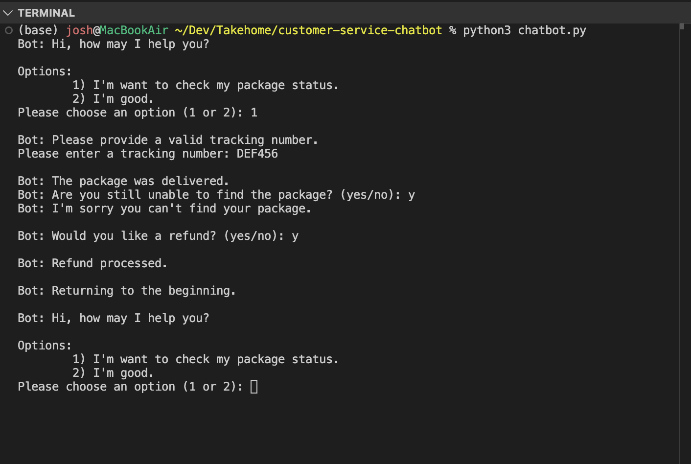

# customer-service-chatbot
This is a simple command line chatbot that helps users check the status of a package.

## Setup & Installation
1. Clone this repository
2. Run the chatbot in your terminal by running this command: 
```
python3 chatbot.py
```

## Approach Summary
The chatbot simulates a simple customer service interaction for users who want to check the status of their package.

### Design decisions:
- Users choose between checking a package or exiting
- Tracking number entry + validation
- The chatbot checks if the tracking number exists in the mock database, with error handling for invalid tracking numbers.
- For delayed/missing/misdelivered packages, the bot asks whether the user wants a refund and handles their decision.
- After resolving an issue, the chatbot returns to the main menu so users can check another package.

### Status-specific responses 
Each package state triggers a unique conversational path:
- In Transit → Provide ETA
- Delivered → Ask if the package was found + offer refund if missing
- Delayed → Provide updated ETA + offer refund if the user asks for it
- Missing → Offer refund

### Error handling:
- Invalid tracking numbers
- Unexpected menu choices
- Invalid yes/no responses

## Chatbot in Action

